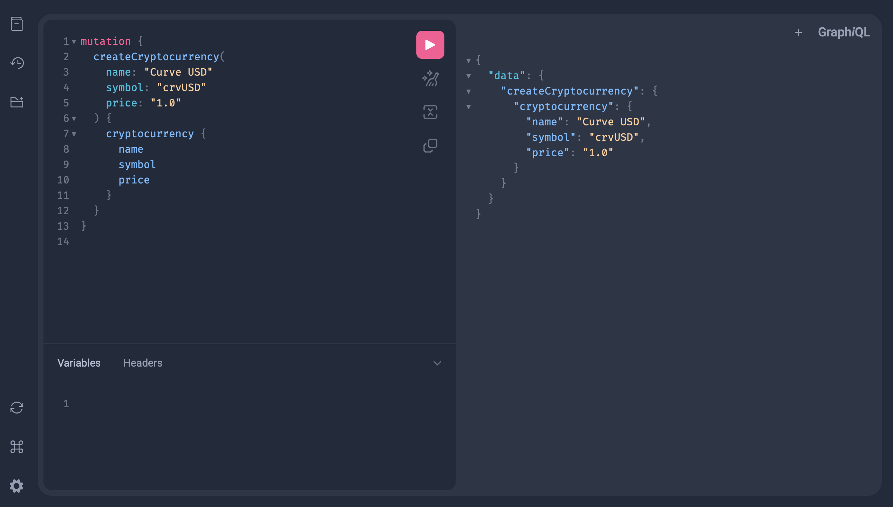
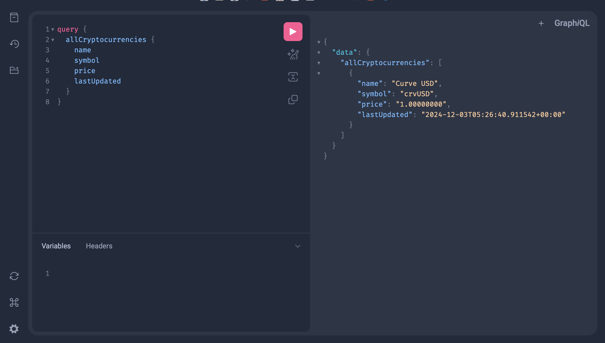
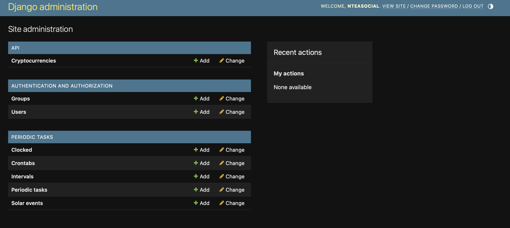
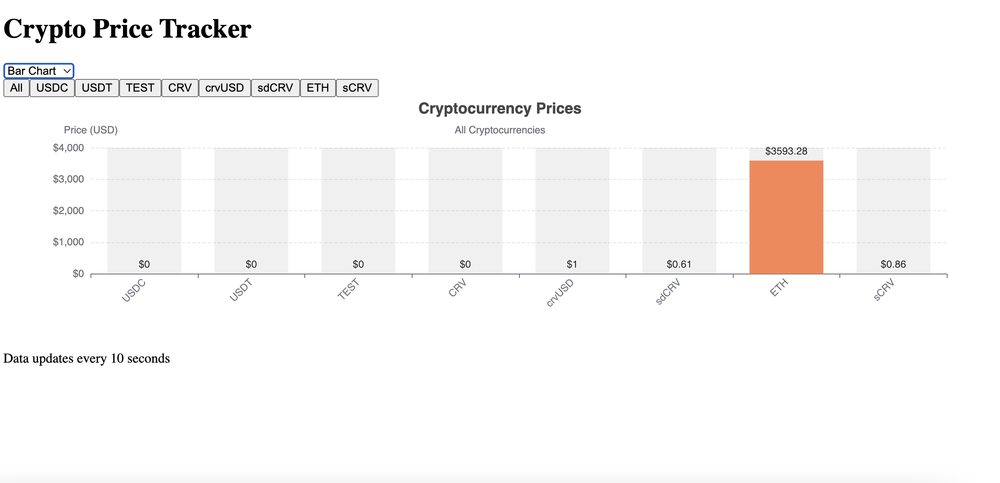
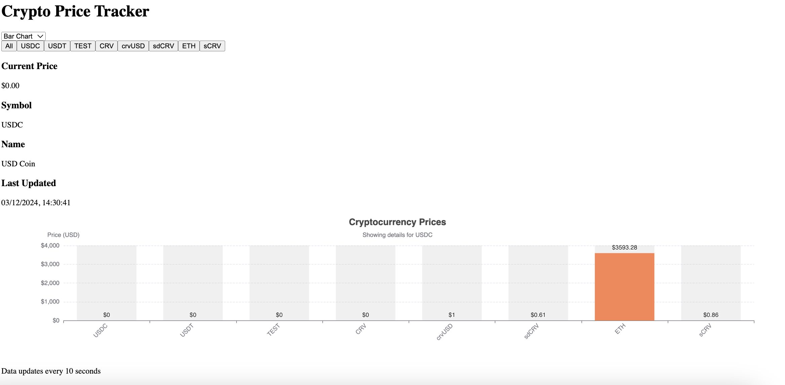
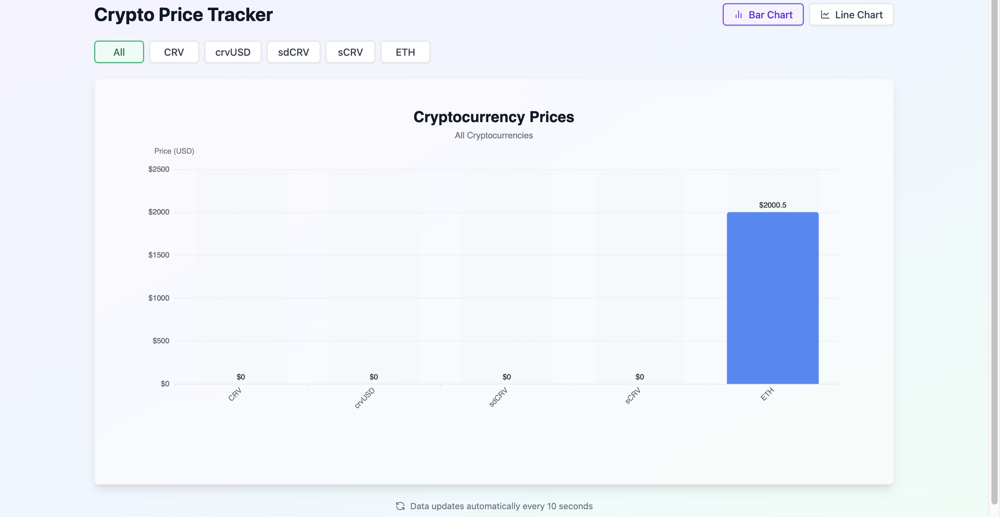
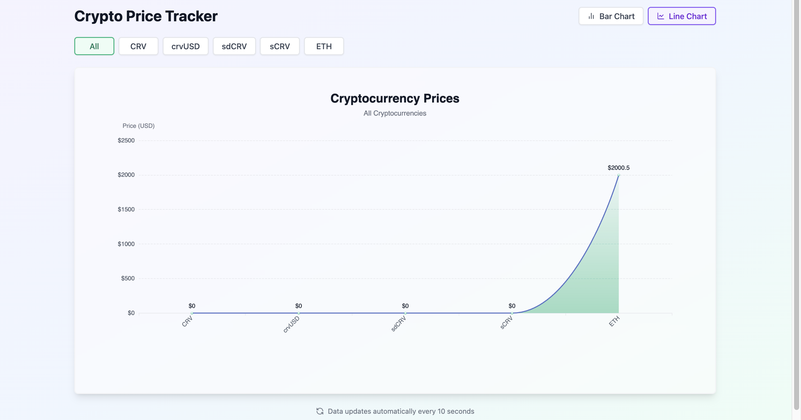

Crypto Price Tracker
A full-stack application that tracks cryptocurrency prices using DeFiLlama API, featuring real-time updates and interactive visualizations.
Features

Real-time price tracking for cryptocurrencies (CRV, crvUSD, sdCRV, ETH, sCRV)
Interactive bar/line chart visualization
GraphQL API with Django backend
Real-time updates using Celery
Responsive Next.js 14 frontend
Docker containerization

Tech Stack
Backend

Django
GraphQL (Graphene)
Celery
Redis
PostgreSQL
DeFiLlama API

Frontend

Next.js 14
Apollo Client
ECharts
Tailwind CSS

Quick Start
Using main startup script:

```sh
chmod +x main_start.sh
./main_start.sh
```

Start services individually:
Backend:

```sh
cd backend
chmod +x start.sh
./start.sh
```

Frontend:

```sh
cd frontend
chmod +x start.sh
./start.sh
```

Access Points

Frontend: http://localhost:3000
GraphQL Playground: http://localhost:8000/graphql
Admin Interface: http://localhost:8000/admin (admin/admin)

Environment Setup
Create .env file in root directory:

```sh
DEBUG=True
SECRET_KEY=gibberish_secret
DB_NAME=crypto_db
DB_USER=postgres
DB_PASSWORD=postgres
DB_HOST=db
DB_PORT=5432
REDIS_URL=redis://redis:6379/0
CORS_ALLOWED_ORIGINS=http://localhost:3000
```

Testing
Backend:

```sh
docker-compose exec backend python manage.py test
```

Monitoring
View logs:

```sh
# All services
docker-compose logs -f

# Specific service
docker-compose logs -f backend
docker-compose logs -f frontend
docker-compose logs -f celery
```

Project Structure

```sh
.
├── backend/
│   ├── api/
│   ├── app/
│   └── docker-compose.yml
├── frontend/
│   ├── components/
│   ├── pages/
│   └── docker-compose.yml
├── .env
├── docker-compose.yml
├── main_start.sh
└── README.md
```

Images













##new ui





